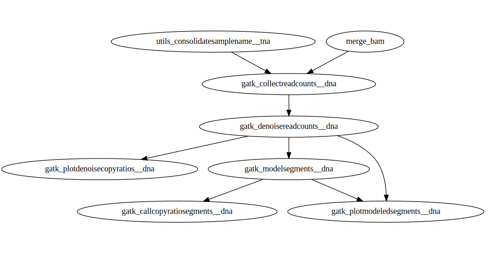

Pipelines are the crux of the CloudConductor infrastructure. Pipelines, in essence, are a directed acyclic graph comprised of modules. Check out an example of an active pipeline:

A module needs to be encapsulated in a pipeline in order to be run using the CloudConductor infrastructure. A pipeline can consist of one or more modules. A pipeline has certain configuration files that need to be provided to CloudConductor in order for it to recognize the pipeline as a valid one. These files are listed below and described in detail in the following steps.

* `<PIPELINE_NAME>_platform_template.config`

* `<PIPELINE_NAME>_resource_template.config`

* `<PIPELINE_NAME>_graph_template.config`

* `<PIPELINE_NAME>_sample_sheet.json`
